  <!-- Header Image -->
  

  <!-- Spacing -->
    

  <!-- Typing Animation -->
  

  <!-- Spacing -->
   

  <!-- Terminal Intro -->
  

  <!-- Spacing -->
   

  <!-- Wavy Divider -->
  

 

---

 

## About Me

  

 

<table>
  <tr>
    <td width="60%" valign="top">

### 👨‍💻 Senior Full-Stack Engineer & DevOps Specialist

Based in **Dhaka, Bangladesh**. I specialize in engineering high-performance, real-time architectures, pixel-perfect user interfaces, bulletproof database structures, and scalable DevOps pipelines.

**🎓 Academic Background:** Computer Science & Engineering Student at **United International University (UIU)**, bridging solid computer science theory with massive real-world software applications.

- 🔥 **Current Momentum**: 160+ tactical commits in the last year across active repositories.
- 🔧 **Core Strategy**: Enterprise-grade optimization, clean design patterns, rapid feature delivery, and robust CI/CD automation.
- 💼 **Open For**: Full-Time Senior Full-Stack Roles, DevOps Integrations, AI Integrations, & High-Scale Contracts.

    </td>
    <td width="40%" align="center">

    </td>
  </tr>
</table>

 

---

 

## 🛠️ Tech Stack

**Frontend Core**

**Backend & Database**

**DevOps & Deployment**

 

---

 

## 📊 Technical Capabilities

  <table width="100%">
    <tr>
      <td width="50%"></td>
      <td width="50%"></td>
    </tr>
    <tr>
      <td width="50%"></td>
      <td width="50%"></td>
    </tr>
    <tr>
      <td width="50%"></td>
      <td width="50%"></td>
    </tr>
  </table>

 

---

 

## 📈 Activity & Analytics

  
    
  

 

---

 

## 🧰 Languages

  

 

---

 

## 📦 DevOps Workflow

  

 

### 🔥 Active Repositories

| Repository | Description |
|:-----------|:------------|
| 🚀 [Nexus-Crypto-Ventory](https://github.com/rbkhan007/Nexus-Crypto-Ventory) | Advanced crypto assets & inventory management framework |
| 🤖 [Rag-Optimized-F-Commerce-SAAS](https://github.com/rbkhan007/Rag-Optimized-F-Commerce-SAAS) | RAG-driven AI system for high-volume Facebook commerce |
| 🛍️ [VeloCommerce-AI](https://github.com/rbkhan007/VeloCommerce-AI) | AI engine tailored for dynamic web marketplace conversions |

 

---

 

## 🌟 Featured Projects

<table align="center" width="100%">
  <tr>
    <td align="center" width="33%" padding="20">

**🤖 VeloCommerce AI**

Next.js 14 • Supabase • OpenAI

    </td>
    <td align="center" width="33%" padding="20">

**💳 Nexus Crypto**

TypeScript • Prisma • PostgreSQL

    </td>
    <td align="center" width="33%" padding="20">

**✨ Portfolio**

Three.js • Tailwind CSS • Vercel

    </td>
  </tr>
</table>

 

---

 

## 🏆 Achievements

  

 

---

 

## 📬 Connect With Me

 

 

---

 

  
    
  <i><b>"Clean code + Relentless optimization + Robust DevOps = Flawless systems."</b></i>

