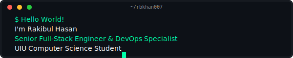
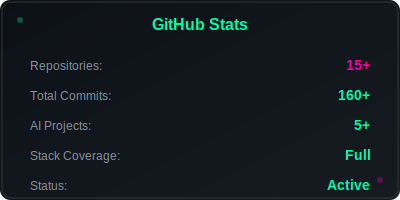
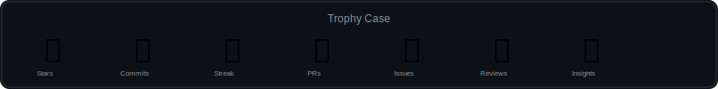

  

   

  

   

  <!-- Availability badge -->
  
  
  

    

  

   

  

 

---

 

## 👋 Hi, I'm Rakibul Hasan

  

 

<table>
  <tr>
    <td width="62%" valign="top">

A **results-driven Full-Stack Developer** who ships production-grade software from **database schema to polished UI**. I specialize in **AI/LLM systems, API orchestration, and cross-platform product design**, with a strong focus on security, performance, and scalable DevOps.

- 🎓 **B.Sc. in Computer Science & Engineering** — United International University (UIU)
- 🧠 **Focus:** RAG pipelines, LLM orchestration, API gateways, enterprise auth & security
- 🚀 **Currently:** Building **OllamoMUI**, an AI gateway emulating Ollama/OpenAI APIs
- 💼 **Looking for:** Full-Time Full-Stack / AI Engineering roles, DevOps automation, and high-scale contracts

    </td>
    <td width="38%" align="center">

</td>
  </tr>
</table>

 

---

 

## 🛠️ Tech Stack

**Languages & Frontend**

**Backend, Data & AI**

**DevOps & Security**

 

---

 

## 💼 Experience

<table width="100%">
  <tr>
    <td width="50%" valign="top" style="border:1px solid #30363d; border-radius:10px; padding:16px;">

**🚀 Founder & Lead Developer — OllamoMUI**
<i>2025 — Present</i>

- Built an **AI gateway** emulating Ollama/OpenAI APIs with **RAG** (pgvector / pg_trgm)
- Shipped **multi-platform clients** (Web, Desktop, Mobile) on a single backend
- Enforced enterprise security: **PBKDF2 auth, SSRF protection, audit logging**

    </td>
    <td width="50%" valign="top" style="border:1px solid #30363d; border-radius:10px; padding:16px;">

**💻 Full-Stack Developer — Freelance**
<i>2024 — Present</i>

- Delivered **production web apps & AI integrations** for global clients
- Developed **RESTful services**, real-time dashboards, and secure auth flows
- Integrated LLM pipelines, RAG search, and payment/automation systems

    </td>
  </tr>
</table>

 

---

 

## 🚀 Featured Projects

<table align="center" width="100%">
  <tr>
    <td align="center" width="33%" style="border:1px solid #30363d; border-radius:10px; padding:14px;">

**🤖 OllamoMUI**
AI Gateway · FastAPI · pgvector
  

    </td>
    <td align="center" width="33%" style="border:1px solid #30363d; border-radius:10px; padding:14px;">

**🎓 GradBridge**
Education · Next.js · Supabase
  

    </td>
    <td align="center" width="33%" style="border:1px solid #30363d; border-radius:10px; padding:14px;">

**🖼️ ClippingBD Studio**
Studio Platform · Vercel
  

    </td>
  </tr>
  <tr><td colspan="3" height="12"></td></tr>
  <tr>
    <td align="center" width="33%" style="border:1px solid #30363d; border-radius:10px; padding:14px;">

**🎯 SiteSniper-AI**
AI Analysis · Python
  

    </td>
    <td align="center" width="33%" style="border:1px solid #30363d; border-radius:10px; padding:14px;">

**🚀 Nexus-Crypto-Ventory**
Crypto · TS · Prisma
  

    </td>
    <td align="center" width="33%" style="border:1px solid #30363d; border-radius:10px; padding:14px;">

**🛍️ VeloCommerce-AI**
Marketplace · AI
  

    </td>
  </tr>
</table>

 

---

 

## 📊 Skills & Activity

  <table width="100%">
    <tr>
      <td width="50%"></td>
      <td width="50%"></td>
    </tr>
    <tr>
      <td width="50%"></td>
      <td width="50%"></td>
    </tr>
    <tr>
      <td width="50%"></td>
      <td width="50%"></td>
    </tr>
  </table>

 

<table width="100%">
  <tr>
    <td width="50%" align="center"></td>
    <td width="50%" align="center"></td>
  </tr>
  <tr>
    <td colspan="2" align="center"></td>
  </tr>
</table>

 

---

 

## 🏆 Achievements

  

 

---

 

## 📬 Let's Work Together

I'm actively looking for **full-time roles, contracts, and AI/DevOps collaborations**. The fastest way to reach me is email or LinkedIn.

  

  

 

---

 

  
    
  <i><b>"Clean code + Relentless optimization + Robust DevOps = Flawless systems."</b></i>

