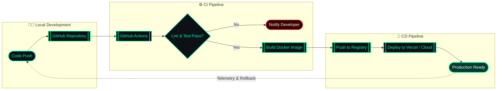
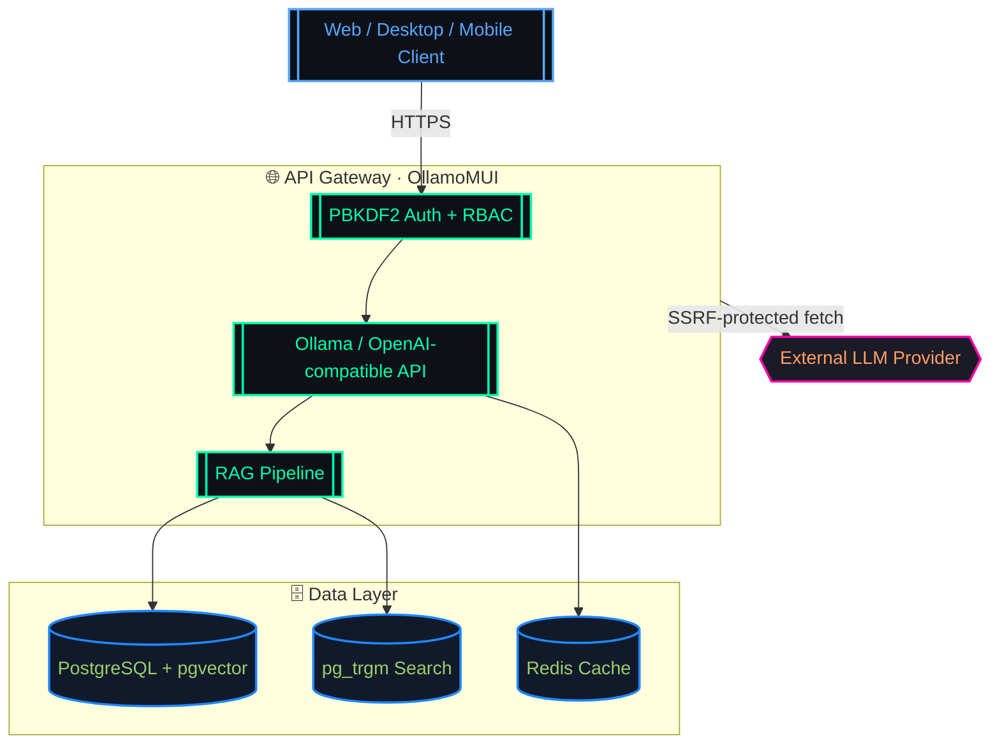

  <!-- Header Image -->
  

    

  <!-- Typing Animation -->
  

   

  <!-- Terminal Intro -->
  

   

  

 

---

 

## About Me

  

 

<table>
  <tr>
    <td width="60%" valign="top">

### 👨‍💻 Full-Stack Developer & AI/LLM Specialist

Based in **Dhaka, Bangladesh**. I'm a results-driven engineer who architects production-grade software from **database schema to polished UI**. I specialize in AI/LLM systems, API orchestration, and cross-platform product design, with a strong focus on security, performance, and scalable DevOps practices.

**🎓 Academic Background:** B.Sc. in Computer Science & Engineering at **United International University (UIU)**.

- 🔥 **Current Momentum**: Building AI gateway systems, multi-platform clients, and secure SaaS products.
- 🧠 **Core Focus**: RAG pipelines, LLM orchestration, API gateways, enterprise-grade authentication & security.
- 💼 **Open For**: Full-Stack Roles, AI/LLM Integrations, DevOps Automation & High-Scale Contracts.

    </td>
    <td width="40%" align="center">

    </td>
  </tr>
</table>

 

---

 

## 🛠️ Tech Stack

**Frontend Core**

**Backend & Database**

**AI & DevOps**

 

---

 

## 📊 Technical Capabilities

  <table width="100%">
    <tr>
      <td width="50%"></td>
      <td width="50%"></td>
    </tr>
    <tr>
      <td width="50%"></td>
      <td width="50%"></td>
    </tr>
    <tr>
      <td width="50%"></td>
      <td width="50%"></td>
    </tr>
  </table>

 

---

 

## 💼 Experience

<table width="100%">
  <tr>
    <td align="left" width="100%" style="border:1px solid #30363d; border-radius:8px; padding:14px;">

**🚀 Founder & Lead Developer — OllamoMUI** &nbsp;*`2025 — Present`*
<ul align="left">
  <li>Built an AI gateway emulating Ollama/OpenAI APIs with RAG (pgvector / pg_trgm).</li>
  <li>Shipped multi-platform clients (Web, Desktop, Mobile) on a single backend.</li>
  <li>Enforced enterprise security: PBKDF2 auth, SSRF protection, audit logging.</li>
</ul>

**💻 Full-Stack Developer (Freelance)** &nbsp;*`2024 — Present`*
<ul align="left">
  <li>Delivered production web apps & AI integrations for global clients.</li>
  <li>Developed RESTful services, real-time dashboards, and secure auth flows.</li>
</ul>

    </td>
  </tr>
</table>

 

---

 

## 📈 Activity & Analytics

  
    
  

 

---

 

## 🧰 Languages

  

 

---

 

## 🌟 Selected Projects

<table align="center" width="100%">
  <tr>
    <td align="center" width="33%" padding="14">

**🎓 GradBridge**

Education platform · Next.js · Supabase

    </td>
    <td align="center" width="33%" padding="14">

**🎯 SiteSniper-AI**

AI web analysis · Python · FastAPI

    </td>
    <td align="center" width="33%" padding="14">

**🖼️ ClippingBD Studio**

Studio platform · Next.js · Vercel

    </td>
  </tr>
</table>

 

### 🔥 Active Repositories

| Repository | Description |
|:-----------|:------------|
| 🤖 [OllamoMUI](https://github.com/rbkhan007/OllamoMUI) | AI gateway emulating Ollama/OpenAI APIs with RAG (pgvector) |
| 🚀 [Nexus-Crypto-Ventory](https://github.com/rbkhan007/Nexus-Crypto-Ventory) | Advanced crypto assets & inventory management framework |
| 🤖 [Rag-Optimized-F-Commerce-SAAS](https://github.com/rbkhan007/Rag-Optimized-F-Commerce-SAAS) | RAG-driven AI system for high-volume Facebook commerce |
| 🛍️ [VeloCommerce-AI](https://github.com/rbkhan007/VeloCommerce-AI) | AI engine tailored for dynamic web marketplace conversions |

 

---

 

## 📦 DevOps Workflow

 

### 🧩 System Architecture

 

---

 

## 🏆 Achievements

  

 

---

 

## 📬 Connect With Me

 

 

---

 

  
    
  <i><b>"Clean code + Relentless optimization + Robust DevOps = Flawless systems."</b></i>

